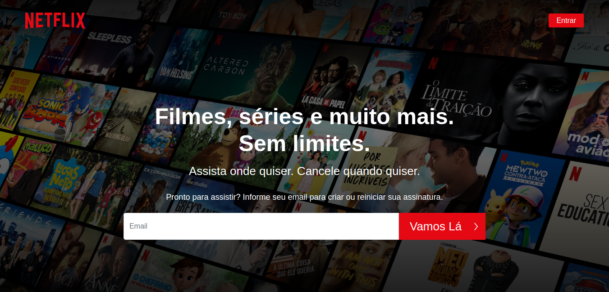
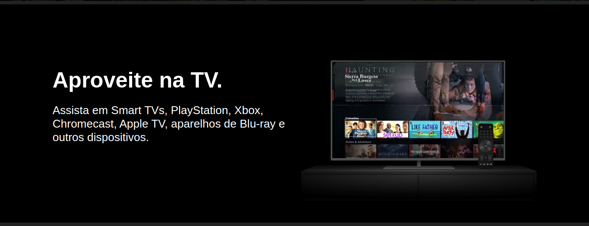
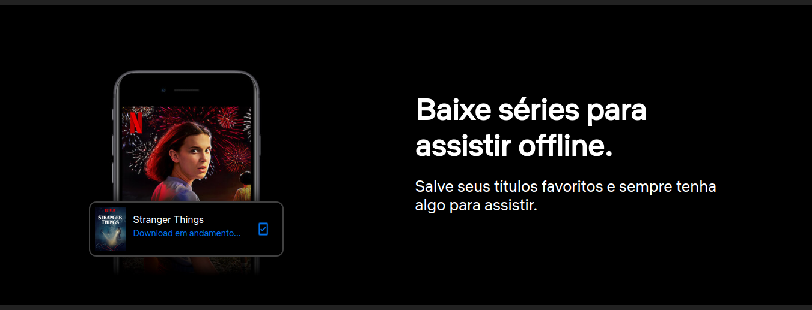
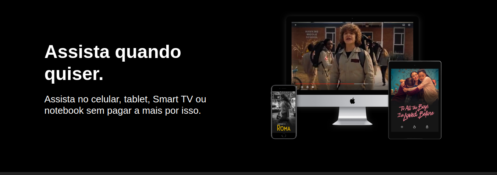
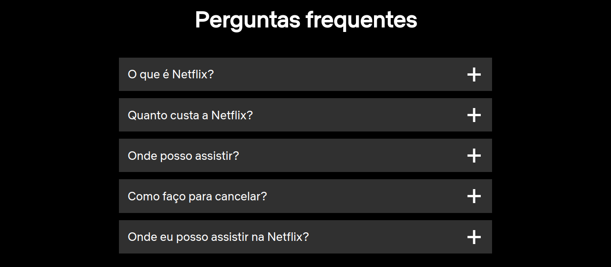
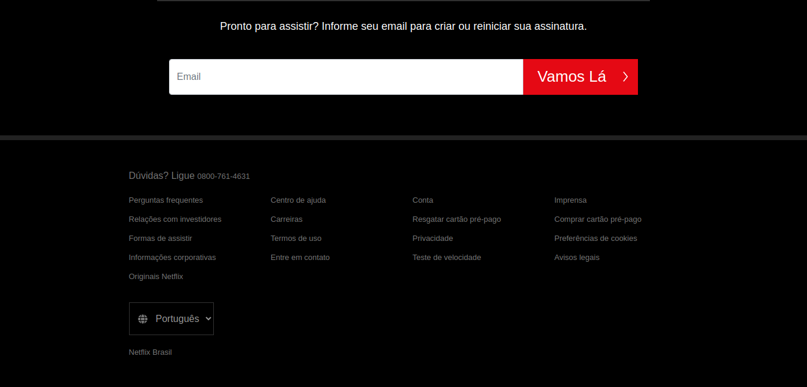

# Demo







## Menu
* [Tecnologias](#Tecnologias)
* [Como Utilizar](#Como-Utilizar)
* [About](#About)
* [Link do Curso](#Link-do-Curso)
* [License](#License)

## Tecnologias
Projeto desenvolvido com as seguintes tecnologias:
* HTML5
* CSS3
* Bootstrap 4

## Como Utilizar
```
1. - Clone o repositório
$ git clone https://github.com/ale-mouraboni/netflix.git

2. - Abra o index.html
```

## About
Clone da página principal da Netflix desenvolvido com bootstrap 4.  
Esse projeto foi desenvolvido com base no canal **Full Devs** - **Clonando a interface da Netflix com Bootstrap 4**.

### Link do Curso:

* [Full Devs - Clonando a interface da Netflix com Bootstrap 4.](https://www.youtube.com/watch?v=qmH6tMy_3V4)

## License
This project is under the MIT license. See the [LICENSE] for more information.

